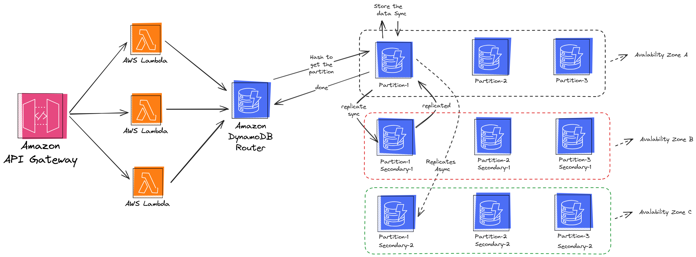

# goserverless

# Functional Requierments : 
- user can write note
- add optional password to the note so it can be only opened with this password 
- add ttl for the note and after it the note will be self-destructed
- after pushing the note, user receives a url to be able to open the note later

# High-Level Design of the architecture : 
